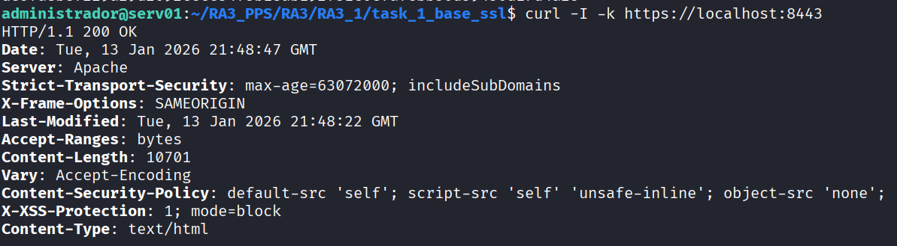

# Task 1: Apache Base Hardening + SSL

Esta fase establece los cimientos de seguridad del servidor. Se implementa una imagen base de Apache configurada con **SSL/TLS (HTTPS)** obligatorio y medidas de **Hardening** para ocultar información sensible y proteger contra ataques básicos de cliente (XSS, Clickjacking) mediante cabeceras HTTP estrictas.

## 📂 Estructura del Directorio

A continuación se detalla la estructura de archivos de configuración y certificados necesarios para esta tarea:

```text
task_1_base_ssl/
├── conf/
│   ├── default-ssl.conf        # Configuración del VirtualHost :443
│   └── user-hardening.conf     # Directivas de seguridad (Headers, ServerTokens)
├── ssl/
│   ├── apache.crt              # Certificado autofirmado (Pública)
│   └── apache.key              # Clave privada (Privada)
├── Dockerfile                  # Receta de construcción de la imagen
└── README.md                   # Documentación técnica

```

---

## 🛠️ Configuración Técnica (Archivos)

### 1. Certificados SSL (`ssl/`)

Se requieren certificados X.509 para habilitar HTTPS.

* **Comando de generación:**
```bash
openssl req -x509 -nodes -days 365 -newkey rsa:2048 -keyout ssl/apache.key -out ssl/apache.crt

```


### 2. Hardening y Cabeceras (`conf/user-hardening.conf`)

Este archivo aplica las directivas de seguridad global. Se inyecta en `/etc/apache2/conf-available/`.

```apache
# Ocultación de identidad del servidor
ServerTokens Prod
ServerSignature Off

# Protección de Directorios
<Directory /var/www/html>
    Options -Indexes
    AllowOverride None
    Require all granted
</Directory>

# Cabeceras de Seguridad (Security Headers)
<IfModule mod_headers.c>
    # HSTS: Fuerza HTTPS por 2 años
    Header always set Strict-Transport-Security "max-age=63072000; includeSubDomains"
    # CSP: Restringe fuentes de contenido a 'self'
    Header set Content-Security-Policy "default-src 'self'; script-src 'self' 'unsafe-inline'; object-src 'none';"
    # XSS Protection
    Header set X-XSS-Protection "1; mode=block"
    Header always append X-Frame-Options SAMEORIGIN
</IfModule>

FileETag None

```

### 3. VirtualHost SSL (`conf/default-ssl.conf`)

Define el sitio seguro en el puerto 443.

```apache
<IfModule mod_ssl.c>
    <VirtualHost _default_:443>
        ServerAdmin webmaster@localhost
        DocumentRoot /var/www/html
        
        SSLEngine on
        SSLCertificateFile /etc/apache2/ssl/apache.crt
        SSLCertificateKeyFile /etc/apache2/ssl/apache.key
        
        ErrorLog ${APACHE_LOG_DIR}/error.log
        CustomLog ${APACHE_LOG_DIR}/access.log combined
    </VirtualHost>
</IfModule>

```

### 4. Dockerfile

El archivo de construcción que ensambla los componentes anteriores.

```dockerfile
FROM debian:bookworm-slim

RUN apt-get update && apt-get install -y apache2 openssl curl && apt-get clean

# Habilitar módulos
RUN a2enmod ssl headers rewrite

# Copia de archivos de seguridad y configuración
RUN mkdir -p /etc/apache2/ssl
COPY ssl/apache.key /etc/apache2/ssl/
COPY ssl/apache.crt /etc/apache2/ssl/
COPY conf/user-hardening.conf /etc/apache2/conf-available/user-hardening.conf
COPY conf/default-ssl.conf /etc/apache2/sites-available/default-ssl.conf

# Aplicar configuraciones
RUN a2enconf user-hardening && a2ensite default-ssl

EXPOSE 80 443
CMD ["apache2ctl", "-D", "FOREGROUND"]

```

---

## 🚀 Despliegue y Validación

### Construcción Manual

```bash
# Construir la imagen
docker build -t pps/pr1 .

# Ejecutar contenedor (Puertos 8080 host -> 80 container, 8443 host -> 443 container)
docker run -d -p 8080:80 -p 8443:443 --name apache_task1 pps/pr1

```

### Validación de Seguridad

Verificamos que el servidor responde, oculta su versión y entrega las cabeceras `Strict-Transport-Security` y `Content-Security-Policy`.

**Comando:**

```bash
curl -I -k https://localhost:8443

```



---

## ☁️ DockerHub

Imagen pre-construida disponible para despliegue rápido:

```bash
docker pull brean19/pps-pr1:latest

```
