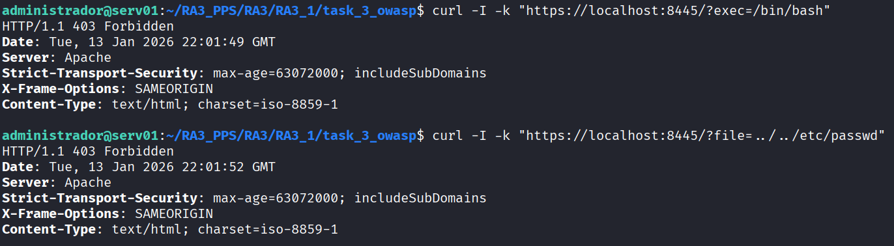

# Task 3: OWASP Core Rule Set (CRS)

En esta fase elevamos el nivel de seguridad integrando el **OWASP Core Rule Set (CRS)**. Mientras que la Fase 2 activó el motor WAF, esta fase le proporciona un conjunto de reglas profesionales y actualizadas para detectar ataques complejos.

Esta imagen **hereda** de la `Task 2` (WAF activado).

## 🎯 Objetivos de Seguridad

1.  **Protección Avanzada:** Defensa contra el OWASP Top 10, incluyendo Inyección SQL (SQLi), Cross-Site Scripting (XSS) avanzado y violaciones de protocolo.
2.  **Reglas Estandarizadas:** Uso de un conjunto de reglas mantenido por la comunidad de seguridad global.
3.  **Prevención de Fugas:** Bloqueo de intentos de acceso a archivos del sistema (Path Traversal).

## 📂 Estructura de Archivos

* `Dockerfile`: Automatiza la descarga (git clone) e integración de las reglas OWASP en Apache.

## 🛠️ Procedimiento de Construcción

### 1. Integración de Reglas (Dockerfile)
En lugar de copiar archivos locales, descargamos la última versión de las reglas directamente desde el repositorio oficial dentro de la imagen:

```dockerfile
# Descarga de reglas
git clone https://github.com/coreruleset/coreruleset.git /usr/share/modsecurity-crs

# Configuración de Apache (security2.conf) para cargar las reglas
echo "IncludeOptional /usr/share/modsecurity-crs/crs-setup.conf" >> ...
echo "IncludeOptional /usr/share/modsecurity-crs/rules/*.conf" >> ...

```

### 2. Docker Build & Run

Comandos utilizados para generar la imagen:

```bash
# Construir imagen (Etiqueta pr3)
docker build -t pps/pr3 .

# Ejecutar contenedor (Puertos 8082->80, 8445->443)
docker run -d -p 8082:80 -p 8445:443 --name apache_owasp pps/pr3

```

## ✅ Validación

Se realizan dos ataques específicos recomendados en la guía de hardening para verificar que las reglas están activas.

**Prueba 1: Command Injection**
Intento de ejecutar una terminal bash vía URL.

```bash
curl -I -k "https://localhost:8445/?exec=/bin/bash"

```

**Prueba 2: Path Traversal**
Intento de leer el archivo de usuarios del sistema (`/etc/passwd`).

```bash
curl -I -k "https://localhost:8445/?file=../../etc/passwd"

```

**Resultado esperado:** Ambos deben devolver `HTTP/1.1 403 Forbidden`.

**Evidencia:**


## ☁️ DockerHub

La imagen está disponible públicamente:

```bash
docker pull brean19/pps-pr3:latest

```
