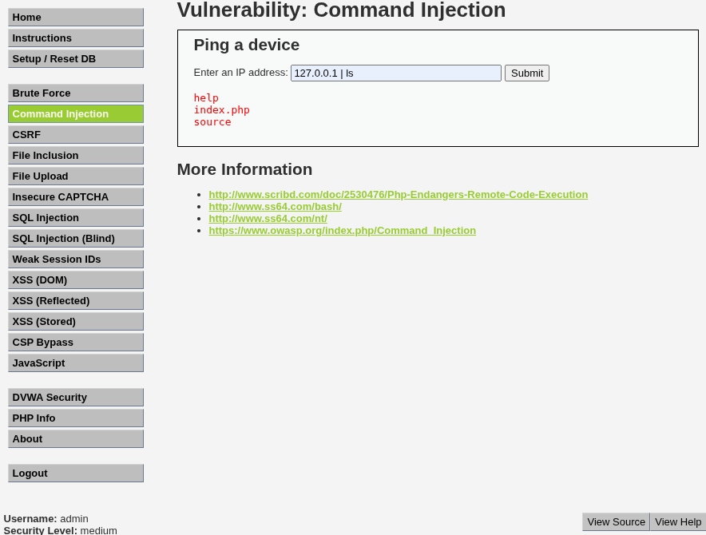

# Práctica 02: Command Injection

## 📝 Descripción
La vulnerabilidad de **Inyección de Comandos** permite a un atacante ejecutar comandos arbitrarios en el sistema operativo del servidor que aloja la aplicación web.

En este desafío, la aplicación ofrece una funcionalidad para realizar un `ping` a una dirección IP proporcionada por el usuario. El error de seguridad reside en que el servidor toma esa entrada y la concatena directamente a una llamada al sistema sin la debida sanitización.

## 🔧 Metodología de Explotación
Para explotar esta vulnerabilidad, utilizamos operadores de encadenamiento de comandos propios de sistemas Linux/Unix.

* **Operador utilizado:** Tubería o *Pipe* (`|`).
* **Función:** Este operador permite ejecutar un segundo comando independientemente del resultado del primero.

El payload inyectado consiste en una IP válida (para satisfacer la lógica básica del script) seguida del operador y el comando malicioso deseado (`ls` para listar archivos).

---

## 🟢 Nivel: LOW

En el nivel bajo, la aplicación no implementa ningún filtro sobre la entrada del usuario. Cualquier carácter especial es aceptado y procesado por la shell.

**Payload:**
```text
127.0.0.1 | ls

```

**Resultado:**
La aplicación ejecuta el `ping` a localhost y, seguidamente, ejecuta `ls`, mostrando el listado de archivos del directorio actual (como `index.php` o `help`).

**Evidencia:**


---

## 🟠 Nivel: MEDIUM

En el nivel medio, la aplicación intenta mitigar el ataque implementando una "lista negra" de caracteres prohibidos (a menudo `;` o `&&`). Sin embargo, en esta configuración, el operador de tubería (`|`) no ha sido filtrado, por lo que el mismo vector de ataque sigue siendo efectivo.

**Payload:**

```text
127.0.0.1 | ls

```

**Resultado:**
La inyección tiene éxito nuevamente, demostrando que la sanitización basada en listas negras es insuficiente si no cubre todos los posibles operadores de ejecución.

**Evidencia:**



