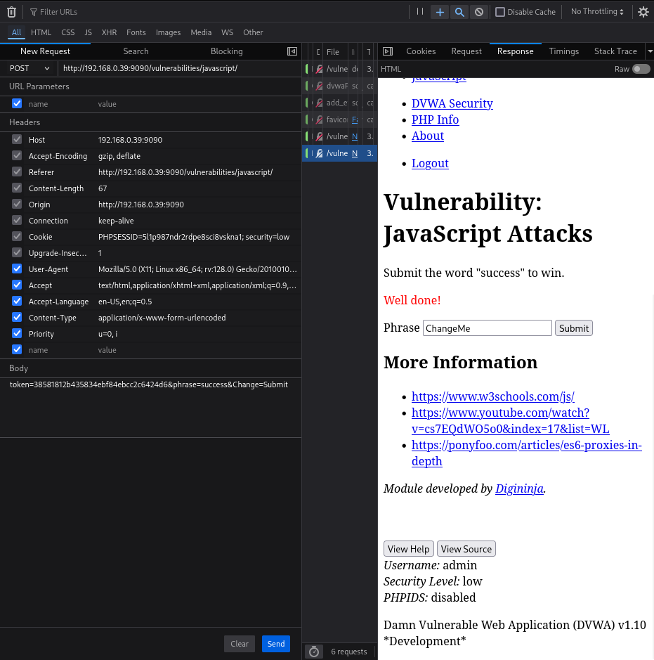

# Práctica 08: JavaScript Attacks

## 📝 Descripción
En esta vulnerabilidad, la seguridad de la aplicación confía en scripts que se ejecutan en el lado del cliente (navegador). Como el código JavaScript es visible y modificable por el usuario, podemos analizar cómo se generan los tokens de seguridad y manipularlos para realizar acciones no autorizadas.

El objetivo en ambos niveles es enviar la palabra "success" con el token correcto generado manualmente.

---

## 🟢 Nivel: LOW

En el nivel bajo, el JavaScript genera un token MD5 basado en la palabra introducida. Analizando el código (o usando las herramientas), sabemos que el token válido para la palabra "success" es un hash específico.

**Pasos detallados para reproducirlo:**

1.  Escribe `success` en el campo de texto y pulsa **Submit**. (Saldrá "Invalid token", esto es normal).
2.  Abre las herramientas de desarrollador (**F12**) y ve a la pestaña **Network** (Red).
3.  Busca la petición `POST` que acabas de enviar (generalmente la última de la lista).
4.  Haz **Clic Derecho** sobre ella > **Edit and Resend** (Editar y Reenviar).
5.  En el cuerpo de la petición (Body), modifica la línea para que quede exactamente así:
    ```text
    token=38581812b435834ebf84ebcc2c6424d6&phrase=success&Change=Submit
    ```
6.  Pulsa el botón **Send** (Enviar).
7.  **¡IMPORTANTE!** La web no cambiará visualmente. Tienes que ir a la pestaña **Response** (o Preview) dentro de la misma herramienta de desarrollador (a la derecha).
8.  Ahí verás el código HTML de respuesta. Busca la frase: `<span style="color:red">Well done!</span>`.

**Evidencia:**
Captura de la pestaña **Response** mostrando el mensaje "Well done!" dentro del código.



---

## 🟠 Nivel: MEDIUM

En el nivel medio, la lógica del script cambia. Para generar el token, coge la palabra, le da la vuelta (reverse) y le añade "XX" al principio y al final.
* Palabra: `success`
* Inversa: `sseccus`
* Token: `XXsseccusXX`

**Pasos detallados para reproducirlo:**

1.  Cambia la seguridad a **Medium**.
2.  Repite el proceso de interceptar la petición (F12 > Network > Edit and Resend).
3.  Esta vez, en el cuerpo de la petición, usa este token modificado:
    ```text
    token=XXsseccusXX&phrase=success&Change=Submit
    ```
4.  Pulsa el botón **Send**.
5.  Nuevamente, no mires la web. Ve a la pestaña **Response** en las herramientas de desarrollador.
6.  Confirma que aparece el mensaje "Well done!".

**Evidencia:**
Captura de la pestaña **Response** con el mensaje de éxito tras enviar el token manipulado.


