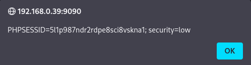

# Práctica 09: Reflected Cross Site Scripting (XSS)

## 📝 Descripción
El **Cross-Site Scripting Reflejado (XSS Reflected)** ocurre cuando una aplicación recibe datos en una petición HTTP (como un parámetro de búsqueda o un formulario) e incluye esos datos en la respuesta de forma insegura, sin validarlos ni escaparlos.

Esto permite a un atacante inyectar scripts maliciosos que se ejecutan en el navegador de la víctima. En esta práctica, inyectaremos código JavaScript para mostrar las cookies de sesión.

---

## 🟢 Nivel: LOW

En el nivel bajo, la aplicación toma el texto que introducimos en el campo "What's your name?" y lo muestra en pantalla tal cual. No hay filtros.

**Payload:**
Utilizamos una etiqueta de imagen (``) intencionadamente errónea. Al intentar cargar una imagen que no existe (`src=x`), el navegador dispara el evento de error (`onerror`) y ejecuta nuestro código.

```html


```

**Pasos para reproducirlo:**

1. Ve al apartado **XSS (Reflected)**.
2. Copia el payload de arriba y pégalo en el cuadro de texto.
3. Pulsa **Submit**.

**Evidencia:**
Inmediatamente aparece una ventana emergente (pop-up) mostrando las cookies de sesión, confirmando la ejecución del código.


---

## 🟠 Nivel: MEDIUM

En el nivel medio, el desarrollador ha intentado proteger la web eliminando la etiqueta `<script>` del texto introducido. Sin embargo, esta protección es insuficiente porque existen muchas otras formas de ejecutar JavaScript en HTML.

**Payload:**
Como nuestro ataque anterior no utiliza la etiqueta `<script>` (sino ``), el filtro no lo detecta y lo deja pasar.

```html


```

**Pasos para reproducirlo:**

1. Cambia la seguridad a **Medium**.
2. Vuelve a pegar exactamente el mismo código en el formulario.
3. Pulsa **Submit**.

**Evidencia:**
El filtro falla al detener el ataque y volvemos a obtener la ventana emergente con las cookies.


