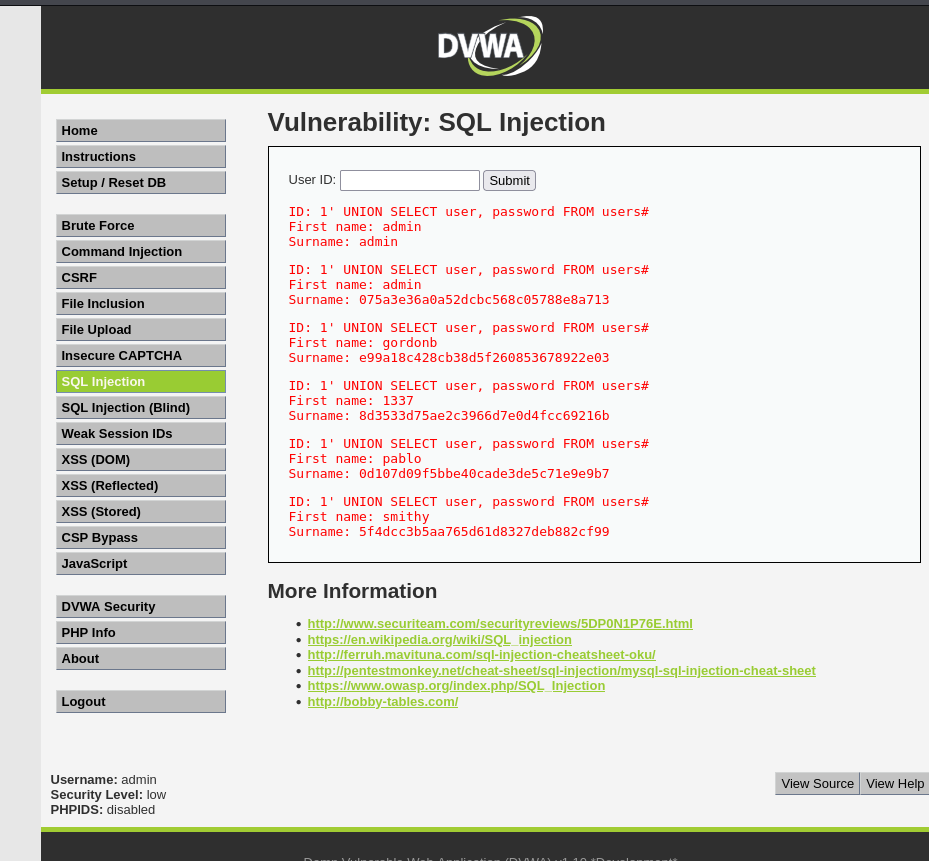

# Práctica 10: SQL Injection

## 📝 Descripción
La inyección SQL (SQLi) es una vulnerabilidad que permite a un atacante interferir con las consultas que una aplicación realiza a su base de datos.

Al manipular la entrada del usuario, podemos engañar al servidor para que ejecute código SQL arbitrario. Esto nos permite acceder a datos no autorizados, como las contraseñas de todos los usuarios registrados.

---

## 🟢 Nivel: LOW

En el nivel bajo, la aplicación recibe un identificador de usuario (User ID) a través de un cuadro de texto y lo concatena directamente en la consulta SQL sin validación.

**Payload:**
Utilizaremos el operador `UNION` para combinar los resultados de la consulta original con nuestra propia consulta que extrae usuarios y contraseñas. El carácter `'` cierra la cadena de texto original y el `#` comenta el resto de la consulta para evitar errores de sintaxis.

```sql
1' UNION SELECT user, password FROM users#

```

**Pasos para reproducirlo:**

1. Introduce el payload anterior en el cuadro de texto "User ID".
2. Pulsa **Submit**.

**Evidencia:**
La aplicación muestra una lista con todos los usuarios (admin, gordonb, 1337, etc.) y sus contraseñas en formato hash, revelando el contenido completo de la tabla `users`.




---

## 🟠 Nivel: MEDIUM

En el nivel medio, la aplicación protege el campo de entrada utilizando un menú desplegable (que impide escribir texto libremente) y la función `mysql_real_escape_string`, que escapa caracteres especiales como las comillas (`'`).

**⚠️ Nota Importante:**
Para realizar este ataque es necesario interceptar y modificar la petición HTTP, ya que el navegador no nos permite escribir en el menú desplegable. Se recomienda usar **Firefox** y su función de red **"Edit and Resend"**.

**Metodología:**
Aunque se filtran las comillas, el campo `id` es numérico en la base de datos. Esto significa que no necesitamos comillas para realizar la inyección, saltándonos así la protección.

**Pasos detallados:**

1. Selecciona cualquier número en el desplegable y pulsa **Submit**.
2. Abre las herramientas de desarrollador (**F12**) y ve a la pestaña **Network**.
3. Localiza la petición `POST` realizada, haz **Clic Derecho -> Edit and Resend**.
4. En el cuerpo de la petición (Body), modifica el parámetro `id` para inyectar el código SQL sin comillas:
```text
id=1 UNION SELECT user, password FROM users#&Submit=Submit

```


5. Pulsa **Send**.
6. Ve a la pestaña **Response** (o Preview) para ver el resultado.

**Evidencia:**
Al visualizar la respuesta del servidor, observamos nuevamente la lista de usuarios y contraseñas volcada en el HTML, confirmando que la inyección SQL numérica ha tenido éxito.


