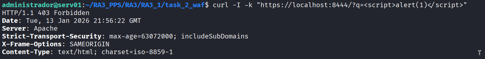

# Task 2: Web Application Firewall (ModSecurity)

En esta fase se implementa una capa de seguridad activa mediante **ModSecurity**, un WAF (Web Application Firewall) de código abierto. Esta herramienta inspecciona el tráfico HTTP en tiempo real para detectar y bloquear ataques maliciosos antes de que alcancen la aplicación web.

Esta imagen sigue la estrategia de **Layered Builds** (Construcción por Capas), heredando directamente de la `Task 1` (Base SSL), por lo que mantiene todas las configuraciones de hardening y certificados previos sin necesidad de reconfigurarlos.

## Estructura del Directorio

Esta tarea se centra en la instalación y activación del módulo WAF sobre la imagen base:

```text
task_2_waf/
├── Dockerfile                  # Script de construcción (Instalación ModSecurity)
└── README.md                   # Documentación técnica

```

---

## Configuración Técnica

### 1. Estrategia de Herencia

No se reinstala Apache desde cero. Se utiliza la imagen `pps/pr1` (generada en la fase anterior) como base, optimizando el tiempo de construcción y asegurando la consistencia de la configuración SSL y las cabeceras de seguridad.

### 2. Configuración del Motor WAF (Dockerfile)

La configuración principal reside en el archivo `/etc/modsecurity/modsecurity.conf`. Por defecto, la instalación establece la directiva `SecRuleEngine DetectionOnly` (modo pasivo: solo registra, no bloquea).

Para activar la protección efectiva, se automatiza la modificación a `SecRuleEngine On` durante el proceso de construcción.

**Contenido del Dockerfile:**

```dockerfile
# 1. Heredar de la imagen base endurecida (Task 1)
FROM pps/pr1

# 2. Instalar el módulo WAF (ModSecurity) y limpiar caché
RUN apt-get update && apt-get install -y \
    libapache2-mod-security2 \
    && apt-get clean

# 3. Preparar y Activar ModSecurity
# Se mueve el archivo de configuración recomendado a producción
RUN cp /etc/modsecurity/modsecurity.conf-recommended /etc/modsecurity/modsecurity.conf

# Se modifica la directiva para activar el bloqueo activo de ataques
RUN sed -i 's/SecRuleEngine DetectionOnly/SecRuleEngine On/' /etc/modsecurity/modsecurity.conf

# 4. El CMD se hereda de la imagen base (apache2ctl -D FOREGROUND)

```

---

## Despliegue y Validación

### Construcción Manual

```bash
# Construir la imagen localmente
docker build -t pps/pr2 .

# Ejecutar contenedor
# Nota: Se utilizan los puertos 8081/8444 para evitar conflictos si la Task 1 sigue activa
docker run -d -p 8081:80 -p 8444:443 --name apache_waf pps/pr2

```

### Validación de Seguridad (Prueba de Ataque)

Para validar el funcionamiento del WAF, se simula un ataque básico de **Cross-Site Scripting (XSS)** inyectando código JavaScript en un parámetro de la URL.

**Comando de ataque:**

```bash
curl -I -k "https://localhost:8444/?q=<script>alert(1)</script>"

```

**Resultado Esperado:**
El servidor debe responder con un código de estado **403 Forbidden**, lo que confirma que ModSecurity ha interceptado y bloqueado la solicitud maliciosa.

**Evidencia de validación:**


---

## Imagen Docker (DockerHub)

Imagen pre-construida disponible para despliegue rápido:

```bash
docker pull brean19/pps-pr2:latest

```

---

**Autor:** Ruben Ferrer 
