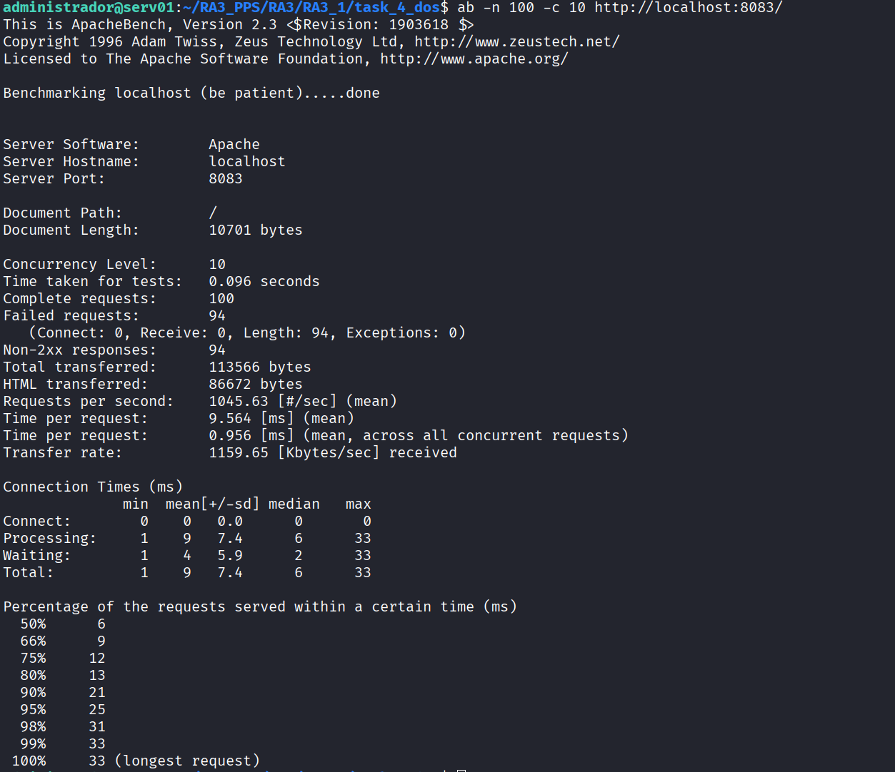

# Task 4: Anti-DoS Protection (ModEvasive)

En esta fase se añade una capa de defensa contra ataques de **Denegación de Servicio (DoS)** y fuerza bruta. Se utiliza el módulo `mod_evasive`, el cual mantiene una tabla interna dinámica de direcciones IP y URIs para detectar patrones de acceso anómalos. Si una dirección IP supera los umbrales de frecuencia definidos, es bloqueada temporalmente (lista negra), devolviendo un código de error 403 Forbidden.

Esta imagen sigue la estrategia de **Layered Builds** (Construcción por Capas), heredando de la `Task 3` (OWASP + WAF), sumando la protección volumétrica a la seguridad aplicativa ya existente.

## Estructura del Directorio

Se introduce un archivo de configuración personalizado para definir los umbrales de sensibilidad del módulo:

```text
task_4_dos/
├── evasive.conf                # Configuración de umbrales (Modo agresivo para pruebas)
├── Dockerfile                  # Instalación del módulo y gestión de permisos de logs
└── README.md                   # Documentación técnica

```

---

## Configuración Técnica

### 1. Configuración de Umbrales (`evasive.conf`)

Para efectos de esta práctica de laboratorio, se han configurado umbrales **extremadamente bajos (agresivos)**. Esto garantiza que el sistema de protección se active inmediatamente durante las pruebas de estrés, facilitando la validación del bloqueo.

**Parámetros clave:**

```apache
<IfModule mod_evasive20.c>
    DOSHashTableSize    3097
    DOSPageCount        2       # Umbral: Bloquea si se pide la misma página 2 veces en 1 seg
    DOSSiteCount        10      # Umbral: Bloquea si se hacen 10 peticiones totales al sitio en 1 seg
    DOSPageInterval     1
    DOSSiteInterval     1
    DOSBlockingPeriod   10      # Castigo: La IP queda baneada por 10 segundos
    DOSLogDir           "/var/log/mod_evasive"
</IfModule>

```

### 2. Gestión de Logs y Permisos (Dockerfile)

Un punto crítico para el funcionamiento de `mod_evasive` es la gestión de permisos. El módulo requiere escribir en su directorio de logs para gestionar los bloqueos. Si el usuario de Apache (`www-data`) no tiene permisos de escritura, el módulo no funcionará.

**Extracto del Dockerfile:**

```dockerfile
# Heredar de la imagen anterior (OWASP - Task 3)
FROM pps/pr3

# Instalar módulo mod_evasive
RUN apt-get update && apt-get install -y libapache2-mod-evasive && apt-get clean

# Crear directorio de logs y asignar propiedad al usuario web (Crítico)
RUN mkdir -p /var/log/mod_evasive && \
    chown -R www-data:www-data /var/log/mod_evasive

# Inyectar configuración personalizada
COPY evasive.conf /etc/apache2/mods-available/evasive.conf

CMD ["apache2ctl", "-D", "FOREGROUND"]

```

---

## Despliegue y Validación

### Construcción Manual

```bash
# Construir la imagen localmente
docker build -t pps/pr4 .

# Ejecutar contenedor
# Nota: Se utilizan los puertos 8083/8446 para evitar conflictos
docker run -d -p 8083:80 -p 8446:443 --name apache_dos pps/pr4

```

### Validación de Estrés (Stress Test)

Se utiliza la herramienta **Apache Bench (ab)** para simular un ataque de denegación de servicio (DoS), lanzando una ráfaga de peticiones simultáneas desde una misma IP.

**Comando de ataque:**
El siguiente comando envía 100 peticiones totales con una concurrencia de 10 conexiones simultáneas.

```bash
# -n 100: Número total de peticiones
# -c 10:  Concurrencia (usuarios simultáneos)
ab -n 100 -c 10 http://localhost:8083/

```

**Resultado Esperado:**
El reporte final de Apache Bench debe mostrar un alto número de **"Non-2xx responses"**. Esto indica que, tras aceptar las primeras peticiones (dentro del umbral), el servidor detectó el ataque y comenzó a rechazar el resto devolviendo errores `403 Forbidden`.

**Evidencia de validación:**


---

## Imagen Docker (DockerHub)

Imagen pre-construida disponible para despliegue rápido:

```bash
docker pull brean19/pps-pr4:latest

```

---

**Autor:** Ruben Ferrer 
