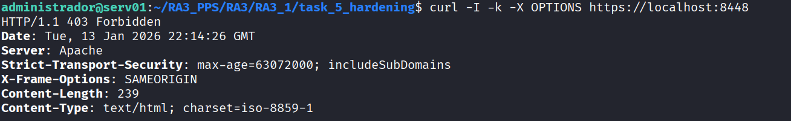

# Task 5: Apache Best Practices Hardening

En esta fase final dedicada a Apache, se aplican medidas de **ajuste fino** (*fine-tuning*) recomendadas por guías de seguridad reconocidas (CIS Benchmarks, Geekflare). El objetivo es reducir la superficie de ataque mitigando vulnerabilidades de conexión lenta, deshabilitando funcionalidades innecesarias y asegurando los permisos del sistema de archivos.

Esta imagen sigue la estrategia de **Layered Builds** (Construcción por Capas), heredando de la `Task 4` (Anti-DoS), consolidando así todas las capas de seguridad implementadas anteriormente.

## Estructura del Directorio

Se introduce un archivo de configuración específico para directivas de endurecimiento extra y se modifican los permisos del sistema de archivos dentro del Dockerfile:

```text
task_5_hardening/
├── hardening-extra.conf        # Directivas: Timeout, Métodos HTTP, Cookies
├── Dockerfile                  # Aplicación de permisos (Principio de Mínimo Privilegio)
└── README.md                   # Documentación técnica

```

---

## Configuración Técnica

### 1. Directivas de Endurecimiento (`hardening-extra.conf`)

Se aplican configuraciones críticas para mitigar ataques de agotamiento de recursos y reconocimiento del servidor.

**Contenido del archivo:**

```apache
# 1. Mitigación Slowloris:
# Reducimos el tiempo de espera para liberar conexiones lentas maliciosas.
Timeout 60

# 2. Bloqueo de Protocolos Obsoletos:
# Rechazamos peticiones HTTP/1.0 (inseguras frente a secuestro de sesión).
RewriteCond %{THE_REQUEST} !HTTP/1.1$
RewriteRule .* - [F]

# 3. Seguridad de Sesión:
# Forzamos los flags HttpOnly y Secure en todas las cookies generadas.
<IfModule mod_headers.c>
    Header edit Set-Cookie ^(.*)$ $1;HttpOnly;Secure
</IfModule>

# 4. Reducción de Superficie de Ataque:
# Bloqueamos métodos peligrosos (TRACE, TRACK, OPTIONS). 
# Se aplica una política de lista blanca permitiendo solo GET, POST y HEAD.
<Location />
    <LimitExcept GET POST HEAD>
        Deny from all
    </LimitExcept>
</Location>

```

### 2. Permisos del Sistema de Archivos (Dockerfile)

Siguiendo el **Principio de Mínimo Privilegio**, se restringen los permisos sobre los binarios y configuraciones del servidor para que solo el usuario root (propietario) y el grupo de ejecución de Apache (`www-data`) tengan acceso. Esto impide que otros procesos comprometidos puedan leer la configuración.

**Extracto del Dockerfile:**

```dockerfile
# Heredar de la imagen Anti-DoS (Task 4)
FROM pps/pr4

# Inyectar configuración extra
COPY hardening-extra.conf /etc/apache2/conf-available/hardening-extra.conf
RUN a2enconf hardening-extra

# HARDENING DE PERMISOS (chmod 750)
# Se elimina el acceso de lectura/ejecución para 'otros' usuarios en carpetas críticas.
# 7 (Owner/Root): rwx
# 5 (Group/www-data): r-x
# 0 (Others): ---
RUN chmod -R 750 /etc/apache2/conf-available && \
    chmod -R 750 /usr/sbin/apache2

CMD ["apache2ctl", "-D", "FOREGROUND"]

```

---

## Despliegue y Validación

### Construcción Manual

```bash
# Construir la imagen localmente
docker build -t pps/pr5 .

# Ejecutar contenedor
# Nota: Se utilizan los puertos 8085/8448 para evitar conflictos
docker run -d -p 8085:80 -p 8448:443 --name apache_best_practices pps/pr5

```

### Validación de Métodos HTTP

Verificamos que el servidor rechaza activamente métodos que suelen utilizarse para reconocimiento o depuración (como `OPTIONS`), cumpliendo la directiva `<LimitExcept>`.

**Comando de prueba:**

```bash
# Intentamos usar el método OPTIONS
curl -I -k -X OPTIONS https://localhost:8448

```

**Resultado Esperado:**
El servidor debe responder con un código **403 Forbidden** (o 405 Method Not Allowed), confirmando que la directiva de seguridad está bloqueando métodos no esenciales.

**Evidencia de validación:**


---

## Imagen Docker (DockerHub)

Imagen pre-construida disponible para despliegue rápido:

```bash
docker pull brean19/pps-pr5:latest

```

---

**Autor:** Ruben Ferrer 
