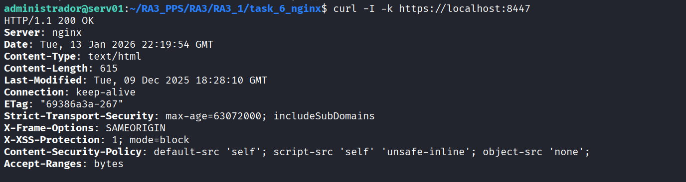

# Task 6: Nginx Secure Server

En esta última tarea, se replican las prácticas de endurecimiento (*Hardening*) utilizando **Nginx**. El objetivo es demostrar que los principios de seguridad —como el cifrado SSL/TLS, la minimización de información y las cabeceras HTTP estrictas— son universales y aplicables independientemente de la tecnología del servidor web subyacente.

A diferencia de las tareas anteriores basadas en Apache, esta imagen es **independiente** (standalone) y no hereda de las capas previas.

## Estructura del Directorio

Nginx centraliza su configuración en bloques de servidor (*server blocks*). La estructura de archivos para esta implementación es la siguiente:

```text
task_6_nginx/
├── conf/
│   └── default.conf            # Configuración endurecida (Sobrescribe la default)
├── ssl/
│   ├── nginx.crt               # Certificado SSL
│   └── nginx.key               # Clave Privada
├── Dockerfile                  # Construcción de la imagen
└── README.md                   # Documentación técnica

```

---

## Configuración Técnica

### 1. Configuración Endurecida (`conf/default.conf`)

Este archivo reemplaza la configuración por defecto de Nginx para inyectar directivas de seguridad directamente en el bloque `server`.

**Configuración aplicada:**

```nginx
server {
    listen 443 ssl;
    server_name localhost;

    # Configuración de Certificados SSL
    ssl_certificate /etc/nginx/ssl/nginx.crt;
    ssl_certificate_key /etc/nginx/ssl/nginx.key;
    ssl_protocols TLSv1.2 TLSv1.3;

    # 1. HARDENING DE INFORMACIÓN
    # Evita que Nginx muestre su número de versión en cabeceras y páginas de error.
    server_tokens off;

    # 2. CABECERAS DE SEGURIDAD (Security Headers)
    # HSTS: Fuerza conexiones seguras por el tiempo definido.
    add_header Strict-Transport-Security "max-age=63072000; includeSubDomains" always;
    # Anti-Clickjacking: Evita que el sitio sea embebido en iframes externos.
    add_header X-Frame-Options "SAMEORIGIN";
    # XSS Protection: Activa el filtro XSS del navegador en modo bloqueo.
    add_header X-XSS-Protection "1; mode=block";
    # Content Security Policy (CSP): Restringe orígenes de contenido.
    add_header Content-Security-Policy "default-src 'self'; script-src 'self' 'unsafe-inline'; object-src 'none';";

    # 3. CONTROL DE MÉTODOS (Whitelisting)
    # Se aplica una política de lista blanca. Cualquier método que no sea GET, HEAD o POST
    # devuelve un código de estado 405 (Method Not Allowed).
    if ($request_method !~ ^(GET|HEAD|POST)$ ) {
        return 405;
    }

    location / {
        root   /usr/share/nginx/html;
        index  index.html index.htm;
    }
}

# Redirección forzosa de HTTP a HTTPS
server {
    listen 80;
    server_name localhost;
    return 301 https://$host$request_uri;
}

```

### 2. Dockerfile

El archivo de construcción parte de la imagen oficial de Nginx, inyecta las credenciales criptográficas y sustituye el archivo de configuración por defecto.

```dockerfile
# Usamos la imagen oficial ligera de Nginx
FROM nginx:latest

# Instalación de herramientas básicas para depuración (curl)
RUN apt-get update && apt-get install -y curl && apt-get clean

# Creación de directorio SSL y copia de credenciales
RUN mkdir -p /etc/nginx/ssl
COPY ssl/nginx.key /etc/nginx/ssl/
COPY ssl/nginx.crt /etc/nginx/ssl/

# Inyección de configuración segura
COPY conf/default.conf /etc/nginx/conf.d/default.conf

EXPOSE 80 443

```

---

## Despliegue y Validación

### Construcción Manual

```bash
# Construir la imagen localmente
docker build -t pps/pr6 .

# Ejecutar contenedor
# Nota: Se utilizan los puertos 8084/8447 para evitar colisiones con los contenedores Apache
docker run -d -p 8084:80 -p 8447:443 --name nginx_extra pps/pr6

```

### Validación de Seguridad

Se utiliza `curl` para inspeccionar las cabeceras HTTP que devuelve el servidor. El objetivo es confirmar que la versión del software está oculta y que las cabeceras de seguridad han sido inyectadas correctamente.

**Comando de validación:**

```bash
curl -I -k https://localhost:8447

```

**Resultado Esperado:**

* `Server: nginx` (Sin especificar versión, ej: no debe aparecer 1.25.x).
* Presencia de `Strict-Transport-Security`, `X-Frame-Options`, `X-XSS-Protection`, etc.

**Evidencia de validación:**


---

## Imagen Docker (DockerHub)

Imagen pre-construida disponible para despliegue rápido:

```bash
docker pull brean19/pps-pr6:latest

```

---

**Autor:** Ruben Ferrer 
