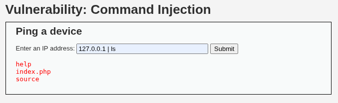

# Práctica 02: Command Injection (Inyección de Comandos)

**Autor:** Ruben Ferrer (brean-rb / 10813818)
**Asignatura:** Puesta en Producción Segura

## Descripción de la Vulnerabilidad

La **Inyección de Comandos** (OS Command Injection) es una vulnerabilidad crítica que permite a un atacante ejecutar comandos arbitrarios en el sistema operativo del servidor que aloja la aplicación. Esto ocurre cuando la aplicación pasa datos proporcionados por el usuario (formularios, cookies, cabeceras HTTP) a una shell del sistema (como `/bin/sh` o `cmd.exe`) sin una validación o sanitización adecuada.

En este escenario, la aplicación DVWA ofrece una herramienta de diagnóstico para realizar un `ping` a una dirección IP. El fallo reside en que la entrada del usuario se concatena directamente a la sentencia del sistema.

## Metodología de Explotación

Para explotar esta vulnerabilidad, se utilizan operadores de encadenamiento de comandos propios de sistemas Unix/Linux. El objetivo es manipular la sentencia original para que, tras ejecutar el `ping`, el servidor procese una segunda instrucción maliciosa.

* **Vector de Ataque:** Operador de Tubería o *Pipe* (`|`).
* **Comportamiento:** En sistemas Unix, `comando1 | comando2` ejecuta el primero y pasa su salida al segundo. Sin embargo, en contextos de inyección simple, a menudo basta para secuenciar la ejecución.
* **Payload Genérico:** `<IP_VALIDA> | <COMANDO_MALICIOSO>`

---

## Nivel: LOW

### Análisis
En el nivel de seguridad bajo, el código fuente del servidor no implementa ningún tipo de filtro o validación sobre la entrada del usuario. La variable IP se pasa directamente a la función `shell_exec()`.

### Reproducción

1. Ingresar una dirección IP válida para satisfacer la lógica básica del ping (ej: `127.0.0.1`).
2. Añadir el operador de tubería seguido del comando a inyectar (`ls` para listar el directorio actual).
3. **Payload:**
```text
127.0.0.1 | ls

```

### Evidencia

La aplicación devuelve la respuesta del ping seguida inmediatamente por el listado de archivos del directorio web, confirmando la Ejecución Remota de Código (RCE).



---

## Nivel: MEDIUM

### Análisis

En el nivel medio, el desarrollador ha intentado mitigar el ataque implementando una **Lista Negra (Blacklist)**. El código busca y elimina caracteres específicos comúnmente usados para encadenar comandos, como el punto y coma (`;`) y el operador AND (`&&`).

**Deficiencia de la Mitigación:**
La seguridad basada en listas negras es intrínsecamente débil si no es exhaustiva. En este caso, el filtro omite el operador de tubería (`|`), dejando una ventana de explotación abierta.

### Reproducción

Al igual que en el nivel bajo, utilizamos el operador que no ha sido filtrado.

1. Ingresar el mismo payload que utiliza la tubería.
2. **Payload:**
```text
127.0.0.1 | ls

```


### Evidencia

La inyección tiene éxito nuevamente. La salida muestra los archivos del sistema, demostrando que la sanitización fue insuficiente para detener el ataque.


