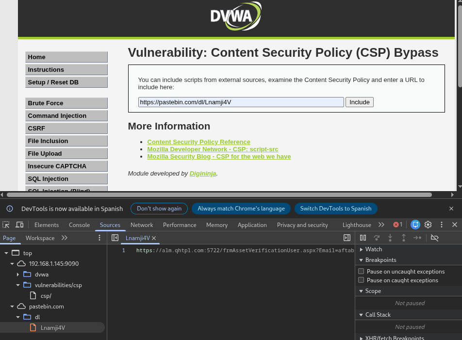

# Práctica 03: Content Security Policy (CSP) Bypass

**Autor:** Ruben Ferrer (brean-rb / 10813818)
**Asignatura:** Puesta en Producción Segura

## Descripción de la Vulnerabilidad
La **Content Security Policy (CSP)** es un mecanismo de seguridad que permite definir qué fuentes de contenido (scripts, estilos, imágenes) son legítimas para ser cargadas por el navegador. Su objetivo principal es mitigar ataques de Cross-Site Scripting (XSS).

En esta práctica se demuestra cómo eludir configuraciones CSP permisivas o mal implementadas para ejecutar código JavaScript no autorizado.

---

## Nivel: LOW

### Análisis
La política de seguridad se basa en una "lista blanca" de dominios de confianza. Al analizar las cabeceras HTTP o el código fuente, se detecta que el dominio externo **pastebin.com** está explícitamente permitido para la carga de scripts.

### Explotación
Para eludir la protección, inyectamos un script cuyo origen (src) apunte al dominio de confianza permitido por la política.

1. **Identificación:** La CSP permite `script-src` desde `https://pastebin.com`.
2. **Inyección:** Se utiliza un enlace a un recurso raw alojado en dicha plataforma.

**Payload:**
```text
[https://pastebin.com/dl/Lnamji4V](https://pastebin.com/dl/Lnamji4V)

```

### Evidencia

El navegador permite la carga del recurso externo al validar que proviene de un dominio en la lista blanca. La petición de red exitosa confirma que la CSP ha sido eludida.



---

## Nivel: MEDIUM

### Análisis

En este nivel, la CSP implementa el uso de un **nonce** (número de un solo uso) para validar scripts en línea. Teóricamente, este valor debe ser aleatorio y único por petición.

**Vulnerabilidad:**
La implementación es defectuosa porque el valor del `nonce` es **estático** (siempre es el mismo) y visible en el código fuente HTML. Esto permite reutilizar el valor legítimo para firmar scripts inyectados por el atacante.

### Explotación

Se inspecciona el código fuente para obtener el valor fijo del nonce y se añade como atributo a la etiqueta `<script>` maliciosa.

**Payload:**

```html
<script nonce="TmV2ZXIgZ29pbmcgdG8gZ2l2ZSB5b3UgdXA=">alert(document.cookie)</script>

```

### Evidencia

Al incluir el nonce correcto, la CSP valida el script como confiable y el navegador ejecuta la alerta mostrando las cookies de sesión.


