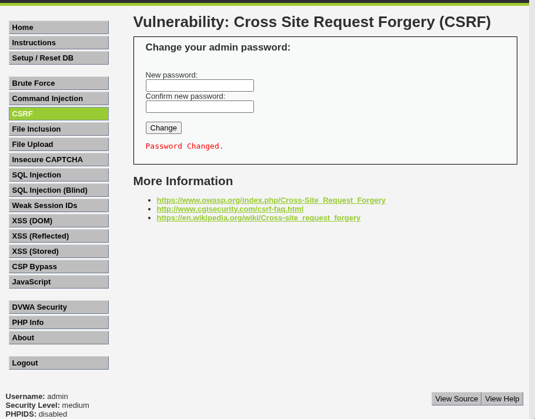

# Práctica 04: Cross-Site Request Forgery (CSRF)

**Autor:** Ruben Ferrer (brean-rb / 10813818)
**Asignatura:** Puesta en Producción Segura

## Descripción de la Vulnerabilidad
La Falsificación de Petición en Sitios Cruzados (**CSRF**) es una vulnerabilidad que obliga a un usuario final a ejecutar acciones no deseadas en una aplicación web en la que está autenticado actualmente.

En esta práctica, se explota la ausencia o debilidad de los tokens anti-CSRF para cambiar la contraseña del administrador sin su conocimiento ni consentimiento.

---

## Nivel: LOW

### Análisis
En el nivel de seguridad bajo, la aplicación presenta dos fallos críticos:
1.  **Ausencia de Tokens:** No implementa ningún mecanismo de verificación (como tokens anti-CSRF) para validar que la petición proviene de un formulario legítimo.
2.  **Uso de GET:** Utiliza el método HTTP `GET` para realizar cambios de estado (modificar la contraseña), exponiendo los parámetros en la URL.

### Explotación
Para ejecutar el ataque, basta con que la víctima visite una URL maliciosa que contenga los parámetros de cambio de contraseña.

**Payload:**
```text
http://<IP_DEL_SERVIDOR>:9090/vulnerabilities/csrf/?password_new=hacked&password_conf=hacked&Change=Change

```

### Evidencia

Al acceder a la URL mientras se mantiene una sesión activa, la aplicación procesa la solicitud y confirma el cambio de contraseña inmediatamente.


---

## Nivel: MEDIUM

### Análisis

En el nivel medio, la aplicación introduce una validación basada en la cabecera HTTP `Referer`. El servidor comprueba el origen de la petición y bloquea aquellas que provienen de dominios externos.

**Limitación:** Esta protección es insuficiente si el ataque se origina desde el propio servidor (Same-Origin).

### Metodología: Ataque Encadenado

Para eludir la verificación del `Referer`, se combina la vulnerabilidad CSRF con una vulnerabilidad de **File Upload** (Subida de Archivos).

1. **Creación del Exploit:** Se genera un archivo HTML (`csrf.html`) que contiene un formulario oculto y un script para enviarlo automáticamente.
2. **Inyección:** Se sube este archivo al servidor víctima utilizando la vulnerabilidad de "File Upload".
3. **Ejecución:** Se accede al archivo subido (`/hackable/uploads/csrf.html`). Al ejecutarse desde dentro del dominio del servidor, la cabecera `Referer` es válida y el cambio de contraseña se autoriza.

**Código del archivo inyectado (`csrf.html`):**

```html
<form action="[http://192.168.0.39:9090/vulnerabilities/csrf/](http://192.168.0.39:9090/vulnerabilities/csrf/)" method="GET" id="hack">
    <input type="hidden" name="password_new" value="medium_hacked">
    <input type="hidden" name="password_conf" value="medium_hacked">
    <input type="hidden" name="Change" value="Change">
</form>

<script>
    document.getElementById('hack').submit();
</script>

```

### Evidencia

La captura muestra el mensaje "Password Changed" tras acceder al archivo HTML alojado en el servidor, confirmando que la protección del `Referer` ha sido eludida.


