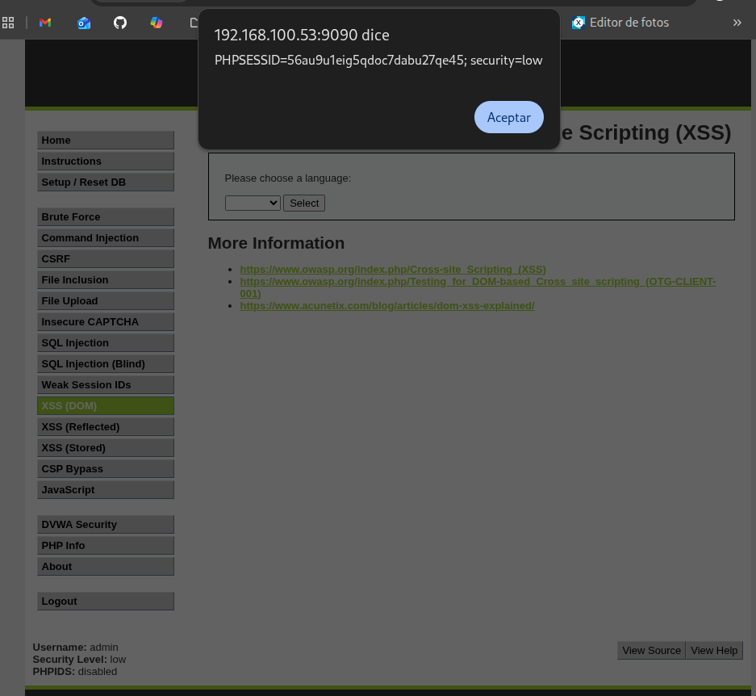
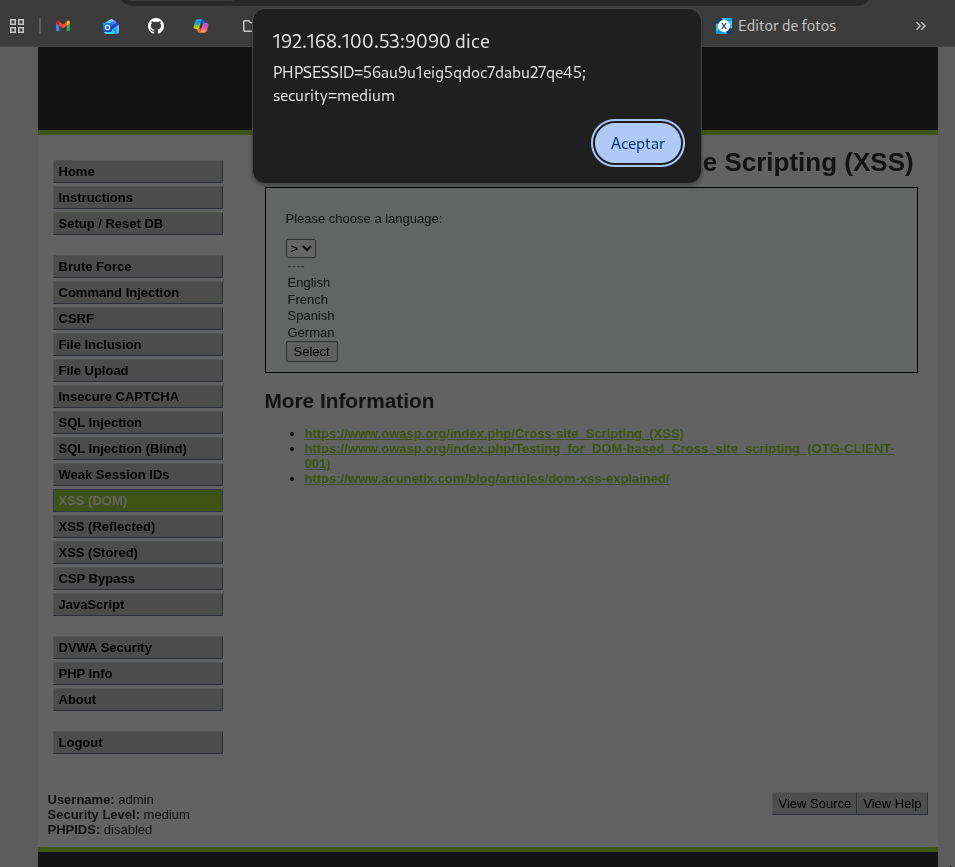

# Práctica 05: DOM Based Cross Site Scripting (XSS)

## 📝 Descripción
El **Cross-Site Scripting basado en DOM (DOM XSS)** es una vulnerabilidad que ocurre cuando el JavaScript del propio navegador coge datos de la URL (sin comprobar si son seguros) y los escribe directamente en el código HTML de la página.

En esta práctica, manipularemos los parámetros de la barra de direcciones para engañar a la página y hacer que ejecute nuestro código malicioso.

---

## 🟢 Nivel: LOW

En el nivel bajo, la página tiene un selector de idiomas. Si miramos la URL, vemos que la elección del idioma se pasa por el parámetro `default`. El código coge lo que pongamos ahí y lo escribe en la web sin filtrar.

**Pasos para reproducirlo:**
1.  Observamos que la URL normal es:
    `http://<IP_DEL_SERVIDOR>:9090/vulnerabilities/xss_d/?default=English`
2.  Borramos la palabra `English` y pegamos nuestro script.

**URL Final del Ataque:**
Copia y pega esto en la barra de direcciones:
```text
http://<IP_DEL_SERVIDOR>:9090/vulnerabilities/xss_d/?default=<script>alert(document.cookie)</script>

```

**Evidencia:**
Al pulsar Enter, el navegador lee el parámetro `default`, encuentra las etiquetas de script y las ejecuta, mostrando la alerta.


---

## 🟠 Nivel: MEDIUM

En el nivel medio, si intentamos lo mismo, no funciona porque el servidor bloquea la palabra `<script>`. Además, nuestro texto no cae en cualquier sitio, sino que está encerrado dentro de una etiqueta `<select>` (un menú desplegable).

**Pasos para reproducirlo:**

1. Necesitamos "escapar" de la cárcel del menú desplegable. Para eso usamos `></option></select>` al principio.
2. Como no podemos usar `<script>`, usamos una imagen falsa (``) que, al fallar al cargar, ejecuta código de error (`onerror`).

**URL Final del Ataque:**
Copia y pega esto en la barra de direcciones:

```text
http://<IP_DEL_SERVIDOR>:9090/vulnerabilities/xss_d/?default=></option></select>

```

**Evidencia:**
El navegador cierra el menú desplegable a la fuerza e intenta cargar la imagen. Al no existir la imagen "x", salta el error y ejecuta nuestra alerta.


