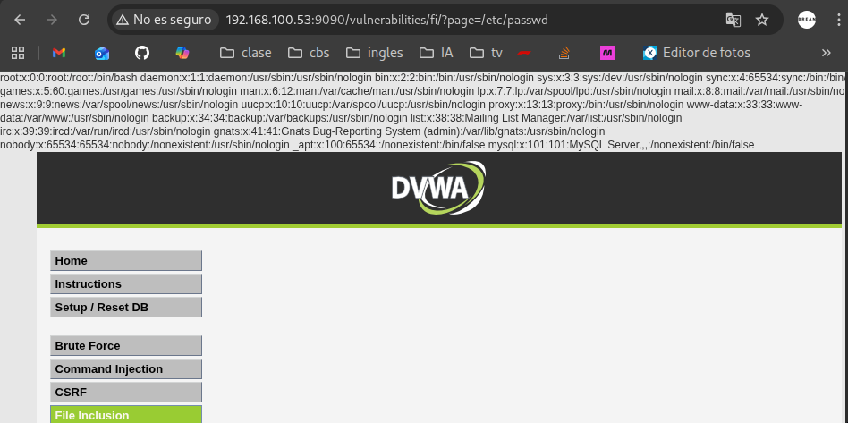
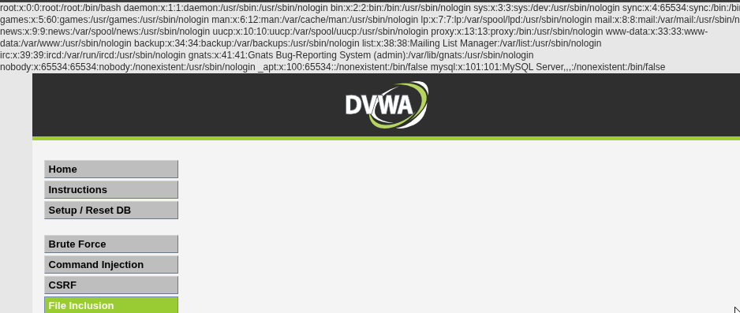

# Práctica 06: File Inclusion

**Autor:** Ruben Ferrer (brean-rb / 10813818)
**Asignatura:** Puesta en Producción Segura

## Descripción de la Vulnerabilidad
La vulnerabilidad de **Inclusión de Archivos (File Inclusion)** permite a un atacante obligar a la aplicación web a procesar y ejecutar archivos, ya sean locales (LFI - Local File Inclusion) o remotos (RFI - Remote File Inclusion).

Este fallo de seguridad ocurre cuando la aplicación utiliza funciones de inclusión de archivos (como `include()`, `require()`, `include_once()`, etc. en PHP) pasando variables controladas por el usuario sin la debida validación o sanitización. En esta práctica, el objetivo es explotar un fallo de LFI para leer el archivo sensible `/etc/passwd`, que contiene la lista de usuarios del sistema operativo del servidor.

---

## Nivel: LOW

### Análisis
En el nivel de seguridad bajo, el código fuente de la aplicación toma el valor del parámetro `page` de la URL y lo pasa directamente a la función de inclusión. No existe ningún mecanismo de filtrado, validación de lista blanca o comprobación de rutas.

**Código Vulnerable (Conceptual):**
```php
$file = $_GET['page'];
include($file);

```

### Reproducción

Para explotar esta vulnerabilidad, se sustituye el nombre del archivo esperado (`include.php`) por la ruta absoluta de un archivo del sistema.

1. Navegar a la sección **File Inclusion**.
2. Modificar el parámetro `page` en la URL para apuntar al archivo de contraseñas de Linux.

**Payload (Ruta Absoluta):**

```text
http://<IP_DEL_SERVIDOR>:9090/vulnerabilities/fi/?page=/etc/passwd

```

### Evidencia

Al cargar la URL modificada, la aplicación incluye el contenido del archivo solicitado en la respuesta HTTP, exponiendo la información de los usuarios del sistema (`root:x:0:0...`).



---

## Nivel: MEDIUM

### Análisis

En el nivel medio, el desarrollador ha intentado mitigar el ataque implementando una lista negra de patrones peligrosos. Específicamente, el código utiliza `str_replace` para eliminar cadenas como `../` (Directory Traversal) y `http://` (Remote File Inclusion).

**Limitación del Filtro:**
La vulnerabilidad persiste porque el filtro se centra en evitar la navegación relativa ("subir directorios" con `../`), pero no impide el uso de **rutas absolutas**. Si el atacante conoce la ubicación exacta del archivo (como `/etc/passwd`), no necesita utilizar los caracteres prohibidos.

### Reproducción

Dado que el filtro es incompleto, el mismo vector de ataque utilizado en el nivel bajo sigue siendo efectivo, ya que la cadena `/etc/passwd` no contiene ninguno de los patrones bloqueados por la lista negra.

**Payload:**

```text
http://<IP_DEL_SERVIDOR>:9090/vulnerabilities/fi/?page=/etc/passwd

```

### Evidencia

El filtro de seguridad no detecta la amenaza y permite la ejecución de la instrucción, mostrando nuevamente el contenido del archivo de sistema.


