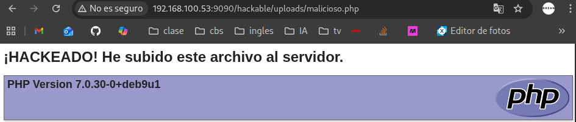

# Práctica 07: File Upload (Subida de Archivos)

**Autor:** Ruben Ferrer (brean-rb / 10813818)
**Asignatura:** Puesta en Producción Segura

## Descripción de la Vulnerabilidad
La vulnerabilidad de **Carga Arbitraria de Archivos (Unrestricted File Upload)** ocurre cuando una aplicación web permite a los usuarios subir archivos al sistema de archivos del servidor sin validar adecuadamente sus características (nombre, extensión, tipo MIME o contenido).

La explotación exitosa de este fallo permite a un atacante subir scripts ejecutables (como archivos `.php`, `.asp`, o `.jsp`), conocidos como *Webshells*. Al acceder a estos archivos a través del navegador, el servidor web ejecuta el código malicioso, otorgando al atacante control sobre la aplicación o el sistema operativo subyacente.

---

## Nivel: LOW

### Análisis
En el nivel de seguridad bajo, la aplicación no implementa ningún mecanismo de validación. El backend confía ciegamente en la entrada del usuario, aceptando cualquier archivo independientemente de su extensión o contenido.

### Metodología de Explotación
El objetivo es subir un archivo PHP que ejecute comandos arbitrarios en el servidor.

1.  **Creación del Payload:** Se genera un archivo llamado `malicioso.php` con el siguiente código de prueba:
    ```php
    <?php
    echo "<h1>¡HACKEADO!</h1>";
    phpinfo();
    ?>
    ```
2.  **Subida:** Se utiliza el formulario estándar de la sección **File Upload** para enviar el archivo.
3.  **Confirmación:** La aplicación devuelve la ruta relativa de almacenamiento: `../../hackable/uploads/malicioso.php`.

### Ejecución
Para activar el payload, se navega directamente a la ruta donde se alojó el archivo.

**URL del Ataque:**
```text
http://<IP_DEL_SERVIDOR>:9090/hackable/uploads/malicioso.php

```

### Evidencia

El servidor interpreta y ejecuta las instrucciones PHP, renderizando el mensaje "HACKEADO" y la tabla de configuración del entorno PHP.



---

## Nivel: MEDIUM

### Análisis

En el nivel medio, el servidor introduce una validación basada en el **MIME Type** (`Content-Type`) del archivo subido. El código comprueba la cabecera HTTP de la petición; si esta indica `application/x-php`, la subida es rechazada. Solo se permiten tipos de imagen como `image/jpeg` o `image/png`.

**Debilidad:** Esta validación es insegura porque el `Content-Type` es un valor controlado por el cliente (navegador) y puede ser manipulado antes de llegar al servidor.

> [!NOTE]
> **Nota Técnica: Herramientas**
> Para esta práctica se recomienda el uso del navegador **Mozilla Firefox**. Su herramienta de desarrollador (Network Tab) incluye la funcionalidad nativa **"Edit and Resend"**, que simplifica la manipulación de peticiones HTTP sin necesidad de configurar proxies externos como Burp Suite.

### Metodología: Bypass de Content-Type

La estrategia consiste en enviar un archivo con extensión `.php` y contenido malicioso, pero "disfrazando" su etiqueta de identificación en la petición HTTP.

1. **Intercepción:** Intentar subir `malicioso.php` y observar el fallo.
2. **Manipulación:**
* Abrir las herramientas de desarrollador (F12) y localizar la petición POST fallida en la pestaña **Network**.
* Seleccionar la opción **Edit and Resend** (Clic derecho).
* Localizar la cabecera `Content-Type: application/x-php`.
* Modificarla manualmente a un tipo permitido:
```text
Content-Type: image/png

```


3. **Envío:** Ejecutar la petición modificada pulsando **Send**.

### Ejecución

Dado que el servidor solo valida la etiqueta y no el contenido real, el archivo `.php` se guarda en el disco. Accedemos a la misma ruta que en el nivel anterior:

```text
http://<IP_DEL_SERVIDOR>:9090/hackable/uploads/malicioso.php

```

### Evidencia

El servidor acepta el archivo PHP creyendo que es una imagen PNG válida debido a la cabecera manipulada, permitiendo la ejecución remota de código (RCE).


