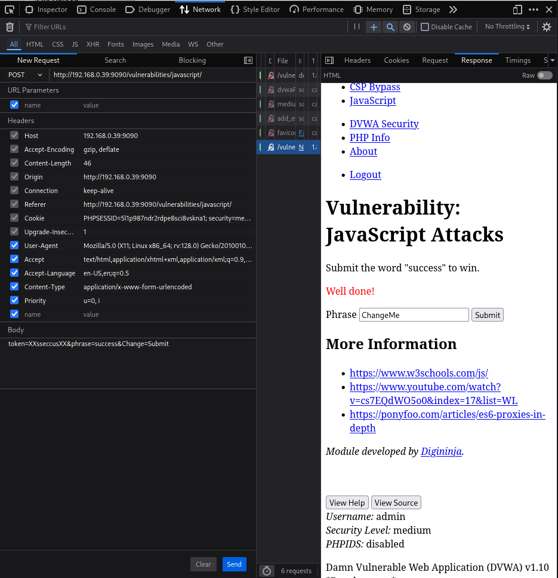

# Práctica 08: JavaScript Attacks

**Autor:** Ruben Ferrer (brean-rb / 10813818)
**Asignatura:** Puesta en Producción Segura

## Descripción de la Vulnerabilidad
Esta vulnerabilidad surge cuando la lógica de seguridad y validación de una aplicación web se delega incorrectamente en el lado del cliente (Client-Side). Dado que el código JavaScript se ejecuta en el navegador del usuario, este es visible, analizable y completamente modificable por un atacante.

En este desafío, el objetivo es enviar la palabra "success" al servidor. Sin embargo, la aplicación requiere un "token" de seguridad generado dinámicamente por funciones JavaScript. La explotación consiste en realizar ingeniería inversa de dichas funciones para generar un token válido manualmente y eludir la protección.

> **Recomendación Técnica**
>
> Para la realización de esta práctica se recomienda el uso del navegador **Mozilla Firefox**. Su herramienta de desarrollador (Pestaña de Red) incluye la funcionalidad nativa **"Edit and Resend"**, que permite modificar los parámetros POST y reenviar la petición sin necesidad de herramientas externas como Burp Suite.

---

## Nivel: LOW

### Análisis
En el nivel de seguridad bajo, el script de la página genera un token MD5 basado en la frase introducida en el campo de texto. Sin embargo, la implementación permite manipular el envío antes de que llegue al servidor.

El token esperado para la palabra clave "success" es un hash MD5 precalculado. Mediante ingeniería inversa del script `source/low.js`, se determina que el token correcto debe ser: `38581812b435834ebf84ebcc2c6424d6` (que corresponde a una función específica del código rot13/md5).

### Reproducción
1.  Introducir la palabra `success` en el campo de texto y pulsar **Submit**. (La aplicación mostrará "Invalid token", lo cual es el comportamiento esperado inicial).
2.  Abrir las herramientas de desarrollador (**F12**) y navegar a la pestaña **Network** (Red).
3.  Localizar la petición `POST` enviada.
4.  Hacer **Clic Derecho** sobre la petición y seleccionar **Edit and Resend**.
5.  En el cuerpo de la petición (Request Body), sustituir los parámetros originales por la siguiente cadena:
    ```text
    token=38581812b435834ebf84ebcc2c6424d6&phrase=success&Change=Submit
    ```
6.  Pulsar **Send**.

### Validación
Dado que estamos manipulando la petición en segundo plano, la interfaz gráfica no se actualizará automáticamente. Es necesario inspeccionar la pestaña **Response** (o Preview) dentro de la herramienta de red.

Busca la cadena de éxito en el código HTML devuelto: `<span style="color:red">Well done!</span>`.

### Evidencia
Captura de la respuesta del servidor confirmando la validez del token inyectado.


---

## Nivel: MEDIUM

### Análisis
En el nivel medio, la lógica de generación del token cambia (`source/medium.js`). El script aplica una transformación de cadena simple en lugar de un hash criptográfico.

**Algoritmo de generación:**
1.  Toma la frase de entrada.
2.  Invierte la cadena (Reverse).
3.  Añade el prefijo "XX" y el sufijo "XX".

**Cálculo del Token:**
* Entrada: `success`
* Inversa: `sseccus`
* Token Final: `XXsseccusXX`

### Reproducción
1.  Asegurarse de que el nivel de seguridad está establecido en **Medium**.
2.  Repetir el proceso de intercepción (F12 > Network > Edit and Resend) sobre una petición enviada previamente.
3.  Modificar el cuerpo de la petición con el nuevo token calculado:
    ```text
    token=XXsseccusXX&phrase=success&Change=Submit
    ```
4.  Pulsar **Send**.

### Validación
Al igual que en el nivel anterior, inspeccionar la pestaña **Response** de la herramienta de desarrollador para confirmar la recepción del mensaje "Well done!".

### Evidencia
Captura de la respuesta HTTP mostrando el mensaje de éxito tras la manipulación del token.


