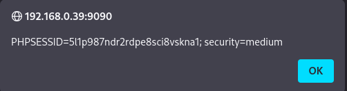

# Práctica 09: Reflected Cross Site Scripting (XSS)

**Autor:** Ruben Ferrer (brean-rb / 10813818)
**Asignatura:** Puesta en Producción Segura

## Descripción de la Vulnerabilidad
El **Cross-Site Scripting Reflejado (Reflected XSS)** es una vulnerabilidad de seguridad web que surge cuando una aplicación recibe datos en una petición HTTP (como parámetros en la URL o datos de un formulario) e incluye esos datos en la respuesta inmediata de forma insegura, sin la validación o el escape adecuados.

A diferencia del XSS Almacenado, el código malicioso no se guarda en la base de datos; simplemente se "refleja" desde el servidor al navegador de la víctima. En esta práctica, el objetivo es inyectar código JavaScript para exfiltrar o visualizar las cookies de sesión del usuario.


---

## Nivel: LOW

### Análisis
En el nivel de seguridad bajo, la aplicación no implementa ningún mecanismo de sanitización. El script del lado del servidor toma la entrada del usuario (parámetro `name`) y la concatena directamente en el código HTML de bienvenida.

### Metodología de Explotación
Para ejecutar código JavaScript arbitrario, inyectamos una carga útil que el navegador interpretará como código ejecutable. Utilizamos un vector basado en eventos de error de imagen para garantizar la ejecución inmediata al renderizar la página.

**Payload:**
```html


```

### Reproducción

1. Navegar a la sección **XSS (Reflected)**.
2. Introducir el payload anterior en el campo de texto ("What's your name?").
3. Pulsar **Submit**.

### Evidencia

El navegador intenta cargar la imagen desde la fuente "x" (inexistente), dispara el evento `onerror` y ejecuta la alerta mostrando las cookies de sesión (`PHPSESSID`).


---

## Nivel: MEDIUM

### Análisis

En el nivel medio, se ha implementado un mecanismo de sanitización basado en listas negras. El código del servidor busca específicamente la etiqueta `<script>` en la entrada del usuario y la elimina (`str_replace`) para prevenir la ejecución de scripts.

**Debilidad del Filtro:**
La seguridad basada en listas negras es insuficiente en el contexto de XSS, ya que existen múltiples vectores de ataque en HTML que no requieren la etiqueta `<script>` explícita para ejecutar JavaScript (por ejemplo, atributos de eventos en ``, `<body>`, `<iframe>`, `<a>`, etc.).

### Metodología: Bypass de Filtro

Dado que el filtro solo bloquea `<script>`, el payload utilizado en el nivel anterior sigue siendo efectivo porque utiliza la etiqueta `` y un manejador de eventos (`onerror`), los cuales no están restringidos.

**Payload:**

```html


```

### Reproducción

1. Establecer el nivel de seguridad en **Medium**.
2. Introducir el mismo payload basado en la etiqueta de imagen.
3. Pulsar **Submit**.

### Evidencia

El filtro no detecta ninguna cadena prohibida, permitiendo que el payload se refleje en la respuesta y ejecute el código JavaScript exitosamente.


