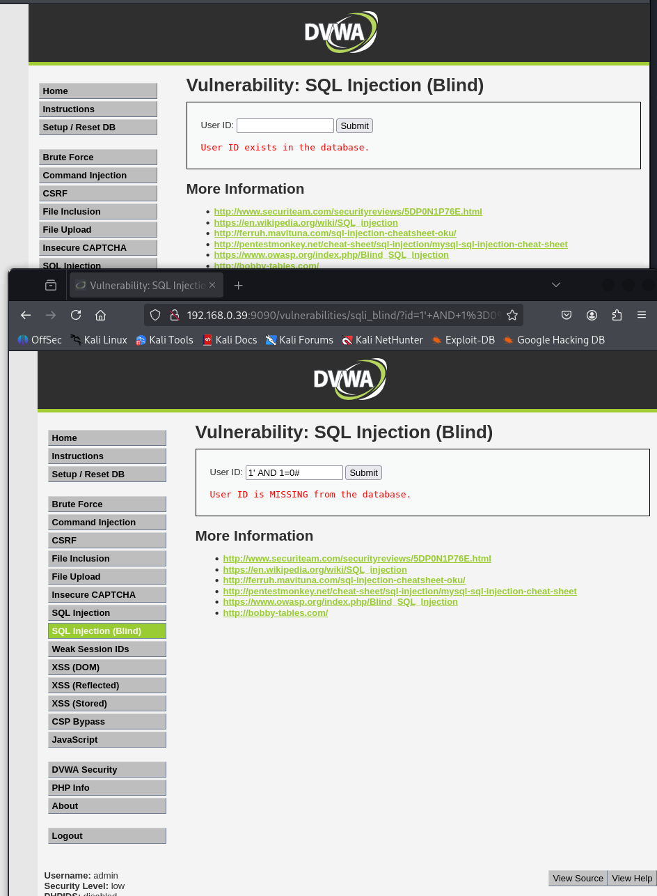
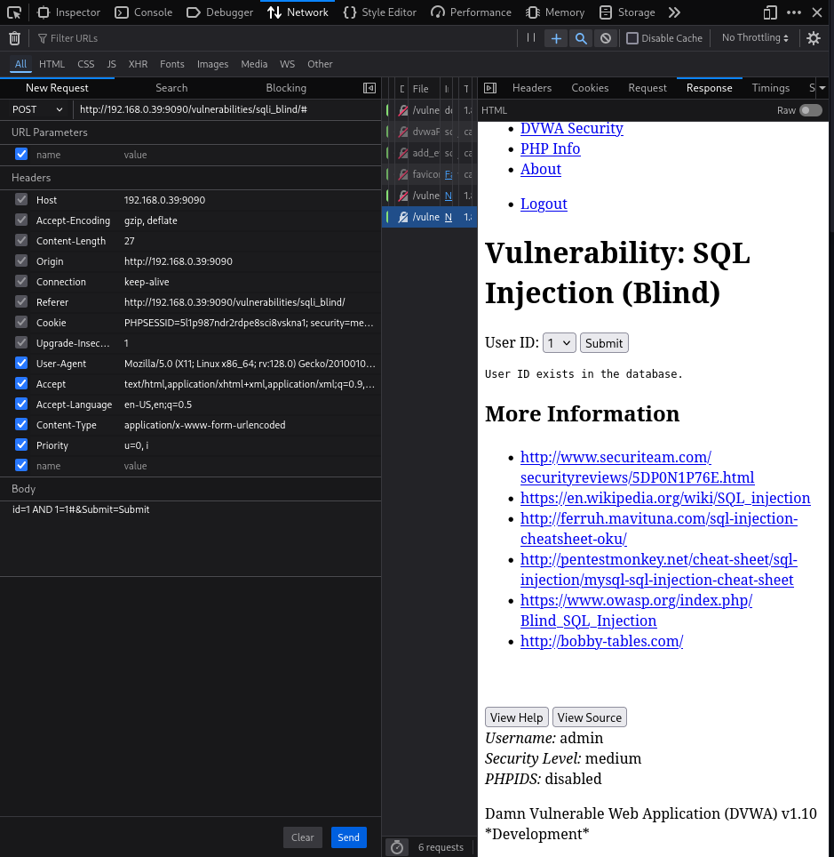

# Práctica 11: SQL Injection (Blind)

**Autor:** Ruben Ferrer (brean-rb / 10813818)
**Asignatura:** Puesta en Producción Segura

## Descripción de la Vulnerabilidad
La **Inyección SQL Ciega (Blind SQLi)** es una variante de la inyección SQL que ocurre cuando una aplicación es vulnerable a la manipulación de consultas, pero su respuesta HTTP no contiene los resultados de la consulta SQL ni detalles de errores de la base de datos.

A diferencia de la inyección clásica (donde vemos los datos volcados en pantalla), en la inyección ciega el atacante debe reconstruir la información formulando preguntas de tipo "Verdadero o Falso" a la base de datos. Dependiendo de si la aplicación responde con un mensaje de éxito, un mensaje de error o un retardo en el tiempo de respuesta, se puede inferir la estructura y el contenido de la base de datos carácter a carácter.


---

## Nivel: LOW

### Análisis
En el nivel de seguridad bajo, la aplicación es vulnerable a una inyección basada en cadenas (String-based). El script PHP concatena la entrada del usuario directamente en la consulta sin validación.

Para confirmar la vulnerabilidad, inyectamos una condición lógica booleana (`AND 1=1`). Si la aplicación devuelve un resultado positivo, significa que ha procesado nuestra lógica.

### Metodología de Explotación
**Payload:**
```sql
1' AND 1=1#

```

* `1'`: Cierra la cadena del ID original.
* `AND 1=1`: Condición siempre verdadera (True).
* `#`: Comenta el resto de la consulta.

### Reproducción

1. Introducir el payload anterior en el campo "User ID".
2. Pulsar **Submit**.

### Evidencia

La aplicación devuelve el mensaje **"User ID exists in the database"**.
*Interpretación:* Dado que `1=1` es verdadero, la consulta devuelve el registro. Si hubiéramos inyectado `1' AND 1=0#` (falso), la aplicación respondería "User ID is MISSING". Esta diferencia de comportamiento confirma que tenemos control lógico sobre la consulta SQL.



---

## Nivel: MEDIUM

### Análisis

En el nivel medio, la aplicación utiliza `mysql_real_escape_string` para escapar caracteres especiales (como comillas) y un menú desplegable para restringir la entrada.

**Vulnerabilidad:**
Al igual que en la práctica de SQLi estándar, la consulta en el backend trata el parámetro `id` como un número entero (`SELECT ... WHERE id = $id`). Esto hace que las comillas no sean necesarias para la inyección, inutilizando la protección de escape de caracteres.

### Metodología: Intercepción de Peticiones

Debido a la restricción del menú desplegable (`<select>`), es necesario manipular la petición HTTP en tránsito.

**Payload Numérico:**

```sql
1 AND 1=1#

```

### Reproducción

1. **Selección:** Elegir un usuario válido en el desplegable y pulsar **Submit**.
2. **Intercepción:** Abrir las herramientas de desarrollador (**F12**), ir a la pestaña **Network** y localizar la petición POST.
3. **Edición:** Utilizar la función **Edit and Resend** (Firefox) para modificar el cuerpo de la petición.
4. **Inyección:** Modificar el parámetro `id` inyectando la lógica sin comillas:
```text
id=1 AND 1=1#&Submit=Submit

```


5. **Envío:** Ejecutar la petición modificada pulsando **Send**.

### Evidencia

Al inspeccionar la respuesta del servidor (Pestaña Response), se localiza la cadena **"User ID exists in the database"**. Esto confirma que la inyección numérica ha sido exitosa y que la condición booleana inyectada se ha evaluado como verdadera.


