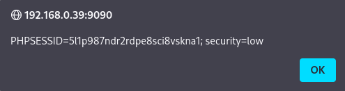
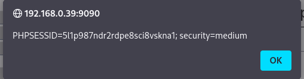

# Práctica 12: Stored Cross Site Scripting (XSS)

**Autor:** Ruben Ferrer (brean-rb / 10813818)
**Asignatura:** Puesta en Producción Segura

## Descripción de la Vulnerabilidad
El **Cross-Site Scripting Almacenado (Stored XSS)**, también conocido como XSS Persistente, es una vulnerabilidad crítica que ocurre cuando una aplicación web recibe datos de una fuente no confiable y los almacena en su base de datos (o sistema de archivos) sin la debida sanitización.

A diferencia del XSS Reflejado, donde el script malicioso solo afecta al usuario que hace clic en el enlace, en el XSS Almacenado el código se ejecuta automáticamente en el navegador de **cualquier usuario** que visite la página infectada, convirtiéndolo en un vector de ataque masivo y persistente.


---

## Nivel: LOW

### Análisis
En el nivel de seguridad bajo, la aplicación implementa un libro de visitas (Guestbook) que permite a los usuarios dejar comentarios. El campo "Message" no realiza ninguna validación ni limpieza de la entrada, permitiendo la inyección directa de etiquetas HTML y JavaScript.

### Metodología de Explotación
Utilizamos un payload basado en eventos HTML (`onerror`) para garantizar la ejecución inmediata al renderizar el mensaje almacenado.

**Payload:**
```html


```

### Reproducción

1. Navegar a la sección **XSS (Stored)**.
2. Introducir un nombre cualquiera en el campo "Name".
3. Pegar el payload anterior en el campo "Message".
4. Pulsar **Sign Guestbook**.

### Evidencia

Al guardarse el mensaje en la base de datos, la página se recarga para mostrar la lista de comentarios. El navegador procesa la etiqueta `` inyectada y ejecuta el script. Dado que es persistente, cualquier recarga posterior de la página volverá a disparar el evento.



---

## Nivel: MEDIUM

### Análisis

En el nivel medio, se han implementado protecciones parciales:

1. **Campo "Message":** Sanitizado correctamente mediante `htmlspecialchars`, lo que neutraliza las etiquetas HTML (convierte `<` en `&lt;`).
2. **Campo "Name":** Sigue siendo vulnerable, aunque presenta dos obstáculos:
* **Filtro de Texto:** Elimina la cadena `<script>` mediante `str_replace`.
* **Restricción de Longitud (Cliente):** El atributo HTML `maxlength="10"` impide escribir payloads largos.


**Debilidades:**

* El filtro `str_replace` es sensible a mayúsculas/minúsculas (Case Sensitive).
* La restricción `maxlength` es una validación del lado del cliente y puede ser modificada fácilmente.

### Metodología: Bypass de Restricciones

Para explotar el campo "Name", combinamos la manipulación del DOM (para ampliar el límite de caracteres) con la ofuscación de mayúsculas (para evadir el filtro).

1. **Manipulación del DOM (Bypass `maxlength`):**
* Hacer **Clic Derecho** sobre el campo de texto **Name** y seleccionar **Inspect** (Inspeccionar).
* Localizar el atributo `maxlength="10"`.
* Modificar el valor a `100` para permitir la entrada del payload completo.


2. **Evasión del Filtro (Bypass `str_replace`):**
* Utilizar una combinación de mayúsculas y minúsculas en la etiqueta script.


**Payload:**

```html
<sCrIpT>alert(document.cookie)</ScRiPt>

```

### Reproducción

Tras modificar el límite de caracteres en el navegador, introducir el payload en el campo **Name**, escribir cualquier texto en el mensaje y pulsar **Sign Guestbook**.

### Evidencia

El nombre se almacena en la base de datos sin ser sanitizado. Al renderizarse en la lista de visitas, el navegador interpreta las etiquetas `<sCrIpT>` como código válido y ejecuta la alerta mostrando las cookies.


