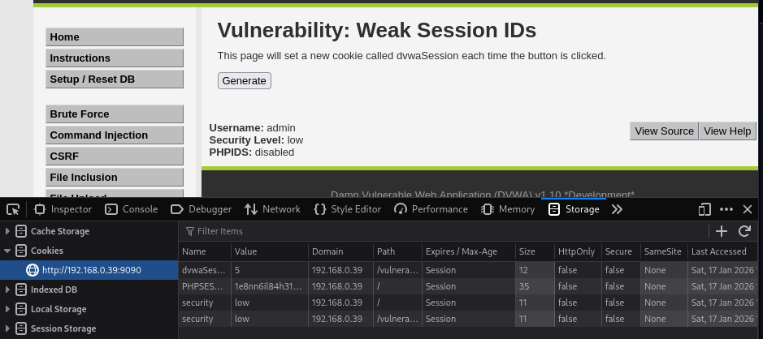
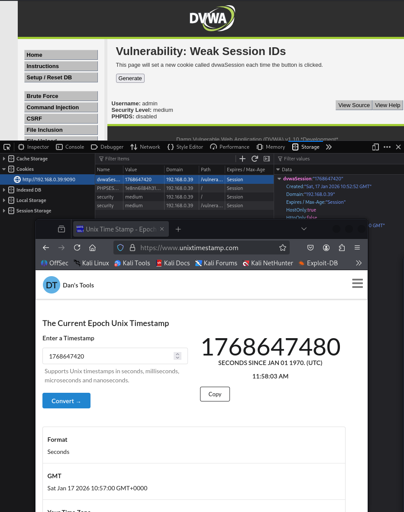

# Práctica 13: Weak Session IDs

**Autor:** Ruben Ferrer (brean-rb / 10813818)
**Asignatura:** Puesta en Producción Segura

## Descripción de la Vulnerabilidad
La gestión de sesiones es un componente crítico en la seguridad de aplicaciones web, ya que el protocolo HTTP es "sin estado" (stateless). Para mantener la continuidad entre peticiones, el servidor asigna un **Identificador de Sesión (Session ID)** único al usuario tras la autenticación, el cual se transmite generalmente a través de cookies.

La vulnerabilidad de **Identificadores de Sesión Débiles** ocurre cuando estos IDs se generan mediante algoritmos predecibles (secuenciales, basados en tiempo, o con entropía insuficiente). Esto permite a un atacante realizar un **Secuestro de Sesión (Session Hijacking)**: adivinar o calcular un ID válido de un usuario legítimo (como un administrador) y acceder a su cuenta sin necesidad de conocer sus credenciales de acceso.

---

## Nivel: LOW

### Análisis
En el nivel de seguridad bajo, la implementación de la generación de sesiones es extremadamente insegura. El sistema utiliza un contador incremental simple (`$last_session_id++`) cada vez que se solicita una nueva sesión.

**Vulnerabilidad:**
La predictibilidad es del 100%. Si un atacante obtiene un ID con valor `5`, puede deducir con certeza que el siguiente usuario autenticado recibirá el ID `6`, o que existe una sesión activa previa con el ID `4`.

### Reproducción
1.  Navegar a la sección **Weak Session IDs**.
2.  Pulsar el botón **Generate Session ID**.
3.  Abrir las herramientas de desarrollador (**F12**), ir a la pestaña **Application** (o Storage) y seleccionar **Cookies**.
4.  Localizar la cookie llamada `dvwaSession`.

### Evidencia
Se observa que el valor de la cookie es un número entero pequeño y secuencial (ej: `1`, `2`, `3`...), lo que demuestra la falta total de aleatoriedad.

---

## Nivel: MEDIUM

### Análisis
En el nivel medio, el desarrollador ha intentado ofuscar el ID evitando el uso de números secuenciales bajos. Sin embargo, el método de generación se basa en la marca de tiempo del sistema (Unix Timestamp).

**Vulnerabilidad:**
El valor de la cookie `dvwaSession` corresponde a los segundos transcurridos desde el 1 de enero de 1970 (Epoch Unix). Aunque parece un número grande y aleatorio (ej: `1737108923`), es altamente predecible. Un atacante solo necesita conocer el momento aproximado en el que la víctima inició sesión para reducir el espacio de búsqueda a un rango muy pequeño de valores (fuerza bruta sobre un intervalo de tiempo).

### Reproducción
1.  Establecer la seguridad en **Medium**.
2.  Pulsar el botón **Generate Session ID**.
3.  Inspeccionar nuevamente el valor de la cookie `dvwaSession`.
4.  Verificar que el valor numérico coincide con el *timestamp* actual (puede comprobarse mediante conversores de tiempo Unix online o consola de comandos).

### Evidencia
La captura muestra un ID de sesión basado en tiempo, confirmando que la entropía sigue siendo insuficiente para garantizar la seguridad de la sesión.

